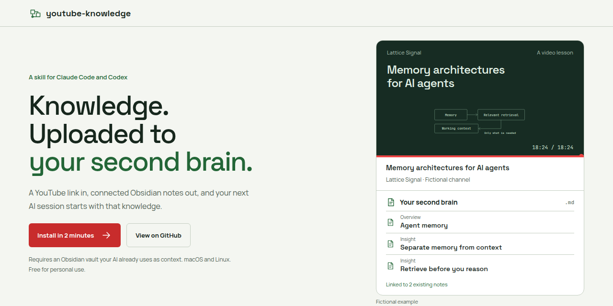
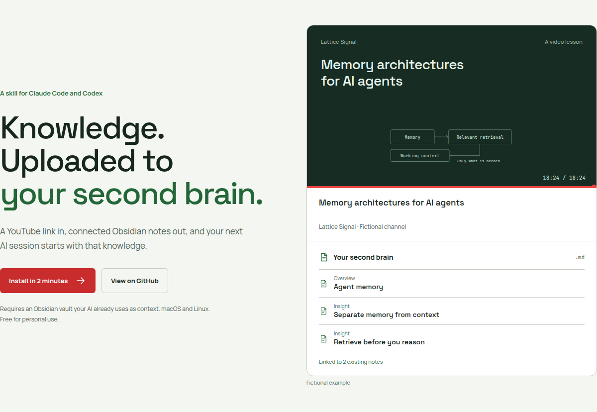
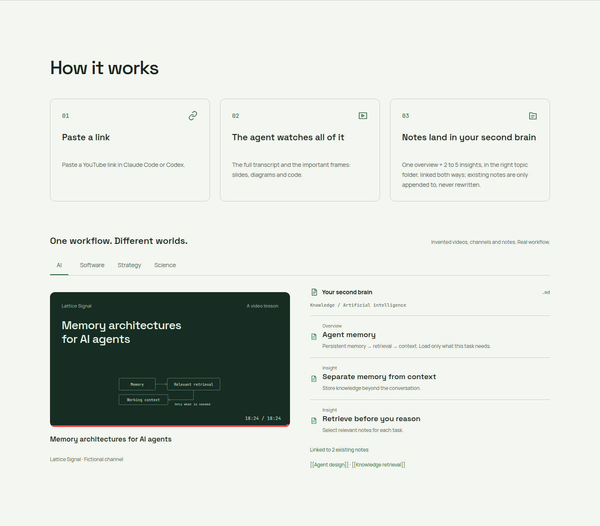
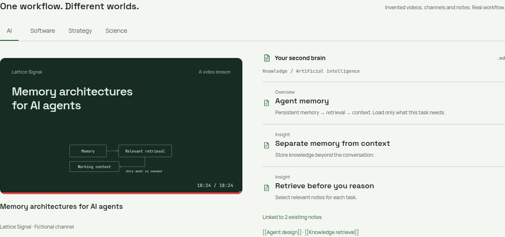
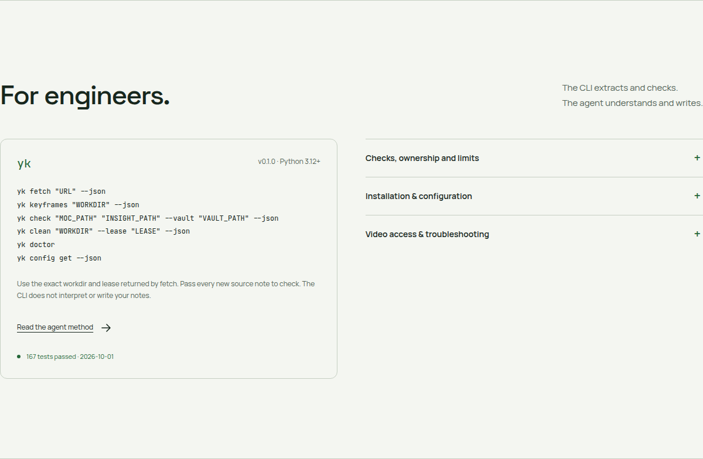

<p align="center">
  <picture>
    <source media="(prefers-color-scheme: dark)" srcset="docs/assets/banner-dark.png">
    
  </picture>
</p>

<p align="center">
  <a href="LICENSE"></a>
  
  <a href="tests/"></a>
  
  
</p>

<h1 align="center">youtube-knowledge</h1>

<p align="center">
  Upload knowledge into your second brain. Give Claude Code or Codex a YouTube link.<br>
  It reads the full transcript and meaningful frames, then writes connected notes your AI can use in future sessions.
</p>

<p align="center">
  <a href="https://youtube-knowledge-dev.vercel.app"><b>Project page (English and Portuguese)</b></a> ·
  <a href="#get-started">Get started</a> ·
  <a href="#for-engineers">For engineers</a> ·
  <a href="#license">License</a>
</p>

## Knowledge, uploaded

Remember the rooftop scene in *The Matrix*, when Trinity needs to fly a helicopter and the pilot
program is uploaded to her in seconds? This skill does that for your second brain. You choose a
video; your agent studies all of it and files what matters as connected notes in your Obsidian
vault. Because your AI reads that vault as context, your next sessions start with that knowledge.

<picture>
  <source media="(prefers-color-scheme: dark)" srcset="docs/assets/readme/hero-dark.png">
  
</picture>

## Requirements

- **A second brain:** an Obsidian vault (the folder where your notes live) that Claude Code or
  Codex already uses as context. This skill adds knowledge to it; your workflow decides when the
  AI reads those notes.
- **An agent:** [Claude Code](https://claude.com/claude-code), [Codex](https://github.com/openai/codex), or both, on your own subscription.
  No separate paid API key.
- **A computer:** macOS or Linux with `curl`. The installer brings everything else (no sudo).

## Inside an upload

<picture>
  <source media="(prefers-color-scheme: dark)" srcset="docs/assets/readme/how-it-works-dark.png">
  
</picture>

Paste the link into Claude Code or Codex. The agent reads the full transcript and examines slides,
diagrams, code and demonstrations in selected frames. Only after that analysis does it write notes.
The new notes go beside the existing notes on the same topic and link back to them.

## What you get

<picture>
  <source media="(prefers-color-scheme: dark)" srcset="docs/assets/readme/examples-dark.png">
  
</picture>

One overview note maps the video. Usually two to five standalone insight notes develop its best
ideas. The agent searches the vault for the right topic folder, adds reciprocal links to related
existing notes, validates the new notes and cleans up its video work after success.

Existing text stays verbatim. Changes to older notes are additive only, with reciprocal links appended.

*The videos, channels and notes in these images are fictional: Lattice Signal (AI), Stack Meridian
(software), Vantage Ledger (strategy) and Fieldwork Almanac (garden science).*

## Get started

Four steps. Works with Claude Code, Codex, or both.

### 1. Run the installer in your terminal

On macOS or Linux, no sudo:

```bash
curl -fsSL https://raw.githubusercontent.com/ogabrielalonso/youtube-knowledge/main/install.sh | bash
```

It installs everything it needs: Python 3.12, yt-dlp, bundled ffmpeg, Deno and CPU Whisper.
It asks for your Obsidian vault folder. The Whisper model downloads on the first transcription
without captions, unless you select a model during installation.

### 2. The skill is added to your agents

| Agent | Default skill folder |
| --- | --- |
| Claude Code | `~/.claude/skills/youtube-knowledge/` |
| Codex | `~/.codex/skills/youtube-knowledge/` |

The installer detects which agents you have. Use `--claude` or `--codex` to choose, or `--all`
for both. If neither agent is detected, it installs both skills. Custom `CLAUDE_CONFIG_DIR`
and `CODEX_HOME` values override the default roots. Each folder receives `SKILL.md`.

### 3. Open a new session

Start a **new** Claude Code or Codex session so it loads the installed skill, ideally in your
vault folder. Run `claude` or `codex` from there. Confirm the agent can read an existing note.

### 4. Paste a video

In the **Claude Code chat**:

```text
/youtube-knowledge https://www.youtube.com/watch?v=VIDEO_ID
```

In the **Codex chat**:

```text
$youtube-knowledge https://www.youtube.com/watch?v=VIDEO_ID
```

Replace this example URL with the video you want to learn from. The agent reports which notes it
created and linked. It uses your own Claude Code or Codex subscription, with no separate paid API key.

**Check it:**

```bash
yk doctor
```

If your shell says `yk: command not found`, run `~/.youtube-knowledge/bin/yk doctor` instead (or add
`~/.local/bin` to your PATH). The skill itself already knows the full path.

**Install for one agent only, from a clone:**

```bash
git clone https://github.com/ogabrielalonso/youtube-knowledge.git
cd youtube-knowledge
bash install.sh --claude
```

For Codex instead:

```bash
bash install.sh --codex
```

**Uninstall, from that clone:**

```bash
bash uninstall.sh
```

Uninstall preserves vault notes, video work directories, backups and shared caches.

## Configuration

The installer supports these flags from a clone:

| Flag | Effect |
| --- | --- |
| `--claude` / `--codex` / `--all` | Choose which agents receive the skill. |
| `--vault PATH` | Set the Obsidian vault folder. |
| `--notes-language LANG` | Set the language of generated notes. |
| `--whisper-model MODEL` | Choose and download a Whisper model at install time. |
| `--yes` | Use non-interactive defaults without editing shell startup files. |

The installer can ask for a vault interactively. You can inspect or change settings later:

```bash
yk config get --json
yk config set vault "/path/to/Obsidian vault"
yk config set notes_language auto
yk config set whisper_model base
yk config set cookies_from_browser chrome
yk config set no_dashes true
yk config set tmp_dir "/path/to/temporary directory"
```

| Key | Meaning |
| --- | --- |
| `vault` | Obsidian vault containing `.obsidian/`. |
| `notes_language` | `auto` uses the video's language, or set a language for note prose. |
| `whisper_model` | Whisper model used when captions are absent. |
| `cookies_from_browser` | Browser used for authorized YouTube access, such as `chrome`, `safari` or `firefox`. |
| `no_dashes` | Reject en and em dashes in notes; enabled by default. |
| `tmp_dir` | Root for temporary video work directories. |

## Troubleshooting

YouTube may show a bot check from a datacenter or VPN IP. On your own machine, set browser cookies
with `yk config set cookies_from_browser chrome` and retry. Cookies may not overcome an IP block;
a residential connection may still be needed. A private video also requires account access.

Run `yk doctor` to check Python, yt-dlp, curl-cffi impersonation, ffmpeg, Deno, yt-dlp EJS,
Whisper, your vault and the installed agent skills. Re-run the installer once to upgrade yt-dlp after a persistent extractor
error. Keep the reported work directory if analysis stops before validation.

---

## For engineers

<picture>
  <source media="(prefers-color-scheme: dark)" srcset="docs/assets/readme/engineers-dark.png">
  
</picture>

`yk` handles deterministic extraction, frame selection, validation and cleanup. The agent reads
and interprets the complete transcript and meaningful keyframes, searches the vault, then writes
the overview and insights. The CLI does not write or interpret the notes by itself.

```bash
yk fetch "URL" --json
yk keyframes "WORKDIR" --json
yk check "MOC_PATH" "INSIGHT_PATH" --vault "VAULT_PATH" --json
yk clean "WORKDIR" --lease "LEASE" --json
yk doctor
yk config get --json
```

Use the exact `workdir` and `lease` returned by that `yk fetch`. Every successful fetch, including
a cached rerun, creates a fresh lease. `yk clean` releases that lease and removes the work directory
only after its last lease is released. `yk check` parses Markdown, validates required metadata
fields and values, minimum non-blank line counts (150 for a MOC, 50 for an insight), forbidden
dashes when configured, and wikilink targets. It cannot establish factual accuracy or usefulness.
The agent must review the content and inspect reciprocal links added to older notes.

The package is in `youtube_knowledge/`: `fetch.py`, `transcript.py`, `media.py`, `keyframes.py`,
`check.py`, `config.py`, `doctor.py` and `cli.py`. The agent method is in [SKILL.md](SKILL.md).
Dependency pins are in [constraints.txt](constraints.txt). The local test run on 2026-10-01 passed **167 tests**.
The supported systems are macOS and Linux. YouTube access, caption availability, and agent
analysis depend on the video and environment.

## License

[PolyForm Noncommercial 1.0.0](LICENSE): free for personal and non-commercial use. Commercial
use requires a separate license.

<p align="center">
  <br>
  Made by <b>Gabriel Alonso</b><br>
  <a href="https://github.com/ogabrielalonso">GitHub</a> · <a href="https://www.linkedin.com/in/ogabrielalonso/">LinkedIn</a> · <a href="https://youtube-knowledge-dev.vercel.app">Project page</a><br>
  <sub>Not affiliated with YouTube or Google.</sub>
</p>
